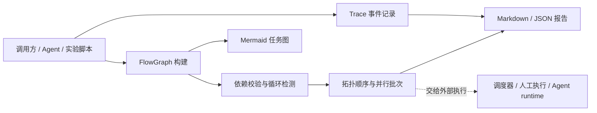

# MoonFlowGraph 项目总览与后续规划

> 本文档是 MoonFlowGraph 的项目级记忆，用于代码审阅、比赛验收、后续开发和版本发布。文中明确区分“已经实现”“当前限制”和“后续计划”，不把规划中的能力写成现状。

## 1. 项目状态快照

截至 2026-06-30：

| 项目 | 当前状态 |
|---|---|
| 模块名 | `AlexenderSokolov/moonflowgraph` |
| 当前版本 | `0.1.0` |
| 主要语言 | MoonBit |
| 许可证 | Apache-2.0 |
| GitHub | <https://github.com/AlexenderSokolov/moonflowgraph> |
| GitLink | <https://gitlink.org.cn/SpringBack_25/moonflowgraph> |
| Mooncakes | <https://mooncakes.io/docs/AlexenderSokolov/moonflowgraph> |
| 当前提交 | 10 个有效提交，GitHub `main` 与 GitLink `master` 同步 |
| 代码规模 | 约 2,040 行 MoonBit，包含库、demo 和测试 |
| 自动测试 | 29 项测试通过（28 项核心行为测试 + 1 项 README 可执行示例） |
| 自动化 | GitHub Actions 执行 `moon check`、`moon test` 和 demo |
| 发布状态 | Mooncakes `0.1.0` 已发布；当前工作树包含尚未发布的可靠性补强 |

仓库不跟踪本地工具链 `.moon/`、构建目录 `_build/`、参赛申请材料和个人信息。

## 2. 问题背景与设计目的

MoonFlowGraph 来自维护科研自动化插件时反复遇到的问题：任务计划、代码中的实际依赖和运行后留下的证据经常分散在不同位置。流程包含文献收集、数据准备、baseline、指标比较和报告撰写后，开发者很难快速回答：

1. 当前哪些任务可以执行，哪些任务可以并行？
2. 工作流是否存在缺失依赖或循环依赖？
3. 一次运行使用了哪些输入，留下了哪些输出和事件？
4. 最终报告或 Agent handoff 可以追溯到哪些执行证据？

本项目把这部分能力抽象成独立 MoonBit 基础库，核心定位是：

**可验证的任务图 + 可解释的执行规划 + 可导出的 provenance trace。**

MoonFlowGraph 不负责调用模型、执行 shell、管理密钥或运行分布式调度。它是上层科研自动化系统的“计划与证据层”，不是完整 Agent runtime。

## 3. 目标用户与使用场景

- **科研实验编排**：组织数据准备、文献分析、baseline、评测和报告任务。
- **Agent 基础设施**：在接入模型调用前，先检查任务拆解和依赖关系是否合理。
- **人工与自动执行混合流程**：生成可并行批次，由外部调度器或开发者决定如何执行。
- **复现与交接**：通过 Markdown、JSON 和 Mermaid 保存执行计划、任务元数据和运行事件。

项目不应扩张为通用图绘制库。Mooncakes 已存在偏图可视化的 [`bobzhang/flowgraph`](https://mooncakes.io/docs/bobzhang/flowgraph)；MoonFlowGraph 的差异化必须保持在执行规划、任务状态和科研 provenance 上。

## 4. 系统架构



### 4.1 数据模型

- `TaskId`：任务字符串标识的显式包装。
- `TaskNode`：保存标题、描述、输入、输出、标签和 `TaskStatus`。
- `Dependency`：表示 `before -> after` 有向依赖。
- `FlowGraph`：保存任务节点和依赖边。
- `ExecutionPlan`：同时保存串行拓扑顺序与可并行批次。
- `TraceEvent`：保存任务、事件类型、消息和调用方提供的时间戳。
- `Trace`：按追加顺序保存事件。

### 4.2 核心执行链

1. `FlowGraph::new()` 创建空图。
2. `add_task()` 添加任务；重复任务 id 会立即报错。
3. `add_dependency()` 添加依赖；重复边会立即报错，缺失端点留到统一校验阶段处理。
4. `validate()` 检查依赖端点和循环路径。
5. `topological_sort()`、`execution_batches()` 或 `plan()` 生成执行计划。
6. 外部正常执行调用 `transition_status()`，历史恢复可显式使用 `update_status()`；事件由 `Trace::record()` 追加。
7. `validate_snapshot()` 检查计划是否过期以及 trace 是否引用未知任务。
8. `to_*_checked()` 或 `snapshot_*()` 安全导出结果；兼容接口 `to_markdown()`、`to_json()` 仍保留。

## 5. 代码结构

| 文件 | 职责 | 阅读重点 |
|---|---|---|
| `flowgraph.mbt` | 数据模型、图构建、查询、校验和执行规划 | DAG、状态迁移、安全快照、计划一致性 |
| `trace.mbt` | trace 记录、事件查询、状态标签和错误消息 | 追加顺序、`latest_for`、机器可读状态 |
| `export.mbt` | Markdown、JSON 和 Mermaid 导出 | checked export、JSON v1、Mermaid 节点映射 |
| `flowgraph_test.mbt` | 28 项核心行为测试 | DAG、状态、快照、JSON、trace、三种导出 |
| `cmd/demo/main.mbt` | 科研工作流演示 | 双入口并行、证据记录、三种输出 |
| `docs/API.md` | 公共 API 速查 | 调用语义和错误行为 |
| `docs/DESIGN.md` | 设计边界与工程取舍 | 为什么不做完整 runtime |
| `docs/ROADMAP.md` | 版本能力和后续方向 | v0.1 与 v0.2 边界 |
| `docs/run-snapshot-v1.schema.json` | JSON 快照正式契约 | 必填字段、状态结构和事件类型 |

## 6. 当前公开能力

### 6.1 图构建与查询

- 创建任务和依赖，拒绝重复任务与重复依赖。
- 查询任务数、依赖数、根节点、叶节点、前驱和后继。
- 更新任务状态并按 id 查询任务。
- 根据调用方提供的 `done` 集合查询当前 ready 任务。
- 通过 `tasks_snapshot()`、`dependencies_snapshot()` 和 `events_snapshot()` 获取与内部数组分离的安全副本。
- 通过 `transition_status()` 执行受约束状态迁移；通过 `runnable_tasks()` 查询前驱均已成功的可运行任务。

### 6.2 校验与规划

- 检查依赖端点是否存在。
- 检测自环和多节点循环，返回可读路径，如 `a -> b -> a`。
- 生成满足依赖的拓扑顺序。
- 生成层级式并行批次。

### 6.3 Trace 与导出

- 按追加顺序记录 `Planned`、`Started`、`Completed`、失败、跳过和备注事件。
- 查询事件总数、某任务全部事件和最近事件。
- 输出面向人工审阅的 Markdown 报告。
- 输出带 `schema_version: 1`、结构化状态和完整控制字符转义的 JSON 快照。
- 输出可嵌入文档的 Mermaid 任务图。
- 安全导出前拒绝过期计划和引用未知任务的 trace。

## 7. Demo 所表达的产品价值

当前 demo 使用两个可并行入口：

```text
collect_papers   prepare_dataset
      |                 |
      v                 v
extract_claims    run_baseline
      \                 /
       v               v
          compare_metrics -> write_report
```

该例子不是为了模拟完整科研 Agent，而是验证三个核心能力：

- 文献与数据准备可以被识别为首批并行任务；
- 文献侧证据与实验侧证据必须在指标比较前汇合；
- trace 能记录检索范围、数据快照、baseline 配置和比较依据，而不只是“任务完成”。

## 8. 已确定的设计决策

- **小图优先**：当前内部使用数组，优先保证实现清楚和行为可测；没有性能证据前不引入复杂索引。
- **统一校验端点**：依赖可以先构建，缺失端点由 `validate()` 统一报告。
- **立即拒绝重复边**：避免依赖计数和导出内容重复。
- **调用方提供时间戳**：支持墙钟时间、逻辑时间和可复现实验编号，不绑定系统时钟。
- **计划与执行分离**：库只回答“应该按什么依赖执行”，不负责真正运行任务。
- **依赖最小化**：当前 JSON 使用手写序列化；后续只有在需要导入或严格 schema 时再引入结构化 JSON 能力。
- **0.1 兼容优先**：已发布的 `pub(all)` 和原始数组访问器暂不删除；新增安全快照接口，真正私有化放入 `0.2.0`。
- **规划与运行就绪分离**：`ready_tasks(done)` 是不读取节点状态的纯规划 API；`runnable_tasks()` 是读取状态并要求前驱成功的执行查询。
- **正常迁移与历史恢复分离**：`transition_status()` 约束正常执行，`update_status()` 保留为不受约束的兼容/回放接口。
- **checked export 优先**：新代码使用 `to_*_checked()` 或 `snapshot_*()`；原始 `to_json()` 保留未版本化的 0.1 输出形状，避免破坏精确快照消费者。

## 9. 当前限制与风险

### 高优先级

1. **旧公共接口仍可绕过不变量**：安全快照接口已经可用，但 `pub(all)`、`tasks()`、`dependencies()` 和 `events()` 为兼容仍暴露内部数组。只有 `0.2.0` 的破坏性迁移才能彻底收口。
2. **只有 JSON 导出，没有导入**：v1 schema 已稳定、生成结果也会由核心 JSON 解析器校验，但尚不能恢复工作流或做 round trip。
3. **运行一致性仍是快照级校验**：当前会检查过期计划和未知 trace 任务，但不会从完整事件序列推导并证明最终节点状态。

### 中优先级

4. **兼容接口仍允许任意状态写入**：正常执行已有 `transition_status()`，但调用方仍可有意使用 `update_status()` 绕过规则；文档必须持续明确两者用途。
5. **算法面向小图**：部分查询和排序使用数组重复扫描；任务规模增大后可能出现明显开销。
6. **失败传播策略固定且较保守**：`runnable_tasks()` 会让失败或跳过的前驱阻塞后继，尚无可配置的失败容忍策略。

### 低优先级

7. **CLI 仍是固定 demo**：尚无读取用户工作流文件的命令行入口。
8. **缺少较大图基准与跨版本兼容测试**：当前已有空图、安全快照、特殊字符和解析器校验，但尚未建立性能阈值和 v1 fixture 兼容矩阵。
9. **项目规模仍小**：当前约 2,040 行 MoonBit。后续应通过真实功能和测试自然增长，不为满足行数参考而填充代码。

## 10. 后续计划

### 阶段 A：验收与发布卫生

目标：让当前 `0.1.0` 的源码、文档和发布记录完全一致。

- [已完成] 修正 `CHANGELOG.md`，把已经进入 `0.1.0` 的功能归入对应版本。
- 在全新临时项目中执行 `moon add AlexenderSokolov/moonflowgraph@0.1.0` 和最小调用 smoke test。
- 核对 GitHub、GitLink、Mooncakes 的链接、版本、许可证和 README。
- [本地已完成] 保持 `moon check`、29 项测试和 demo 通过；远端 CI 需在提交后确认。

验收条件：三端信息一致，干净环境可安装，文档不再把已发布能力标为未发布。

### 阶段 B：v0.1.1 可靠性补强

目标：修复不需要破坏公共概念模型的可靠性问题。

- [已完成] 增加安全快照访问器，同时保留旧接口以兼容 `0.1.0`。
- [已完成] 定义并测试正常状态迁移规则，保留 `update_status()` 作为显式回放接口。
- [已完成] 为 JSON 增加 schema 版本、机器可读状态、正式 schema、空图固定快照和解析器测试。
- [部分完成] 已覆盖空图、断连图、失败阻塞和特殊控制字符；较大图压力测试仍待补充。
- [已完成] 增加计划新鲜度和 trace 任务引用校验，demo 改用 checked export。

验收条件：内部不变量不能被公共查询接口破坏；JSON 格式可做快照回归。

### 阶段 C：v0.2 可用工作流入口

目标：让用户能够描述并加载自己的工作流，而不是修改 demo 源码。

- 将输入 `WorkflowSpec` 与输出 `RunSnapshot` 分成两个明确契约，并支持 JSON 导入/导出 round trip。
- 提供只负责“读取、校验、规划、导出”的 CLI。
- 在迁移说明和版本升级中私有化图与 trace 内部字段，移除旧的数组暴露接口。
- 根据基准结果决定是否为任务和邻接关系增加索引。
- 保持模型调用、shell 执行和分布式调度在项目范围之外。

验收条件：用户能从文件加载工作流，运行校验与规划，并重新导出等价结构。

## 11. 开发、验收与发布流程

### 本地开发

```bash
moon fmt --check
moon check
moon test
moon run cmd/demo
```

Windows 当前也可使用仓库内 `.moon/bin/moon.exe`。`run_check.sh` 和 `run_demo.sh` 提供 Bash 入口。

### 每次改动的验收顺序

1. 运行 `moon fmt --check`。
2. 运行 `moon check`。
3. 运行完整 `moon test`，不只运行新增测试。
4. 涉及导出或 demo 时运行 `moon run cmd/demo`。
5. 检查 `git diff --check` 和 `git status --short`。
6. 确认参赛材料、凭据、`.moon/` 和 `_build/` 未进入提交。

### 版本发布

1. 确认版本号符合语义化版本规则。
2. 更新 `CHANGELOG.md` 和 README 中的版本信息。
3. 执行 `moon publish --dry-run` 并检查打包文件列表。
4. 经项目负责人明确同意后执行 `moon publish`。
5. 验证 Mooncakes 页面和干净环境安装。
6. 再同步 GitHub 与 GitLink 的对应提交或标签。

未经明确同意，不执行 Mooncakes 正式发布。

## 12. 当前验收标准

- `moon check` 无错误或警告。
- `moon fmt --check` 通过。
- `moon test` 全部通过，当前基线为 29 项。
- `moon run cmd/demo` 输出 Markdown、JSON 和 Mermaid。
- GitHub `main` 与 GitLink `master` 指向同一提交。
- GitHub Actions 成功。
- Mooncakes 页面可访问，公开版本可在干净项目中安装。
- README、API、设计、路线图、CHANGELOG 和本文档描述一致。
- 公开仓库不包含个人报名材料、凭据或本地构建产物。

## 13. 已废弃或暂缓方向

- 不再以 `moon-md` 作为主要方向；该方向与现有科研自动化积累关联较弱，生态重复度更高。
- 暂缓完整记忆图和 Agent 框架，避免破坏当前清晰的基础库边界。
- 暂不实现 LLM 调用、shell runner、后台服务、数据库、UI 和密钥管理。
- 不把 Mermaid 继续扩展成通用图形样式系统；图形导出只服务任务图审阅。
